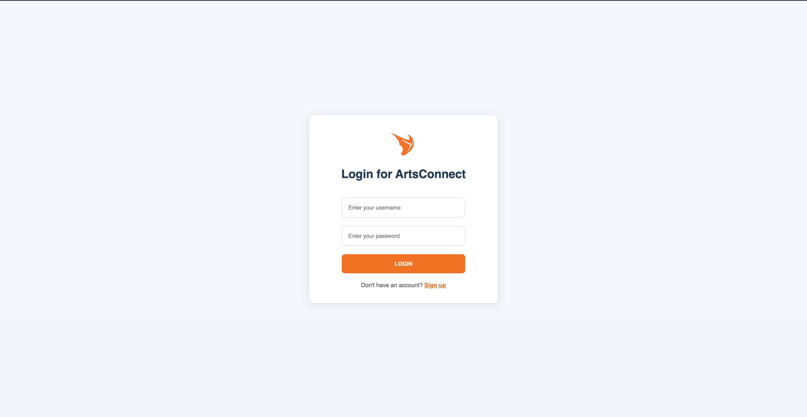
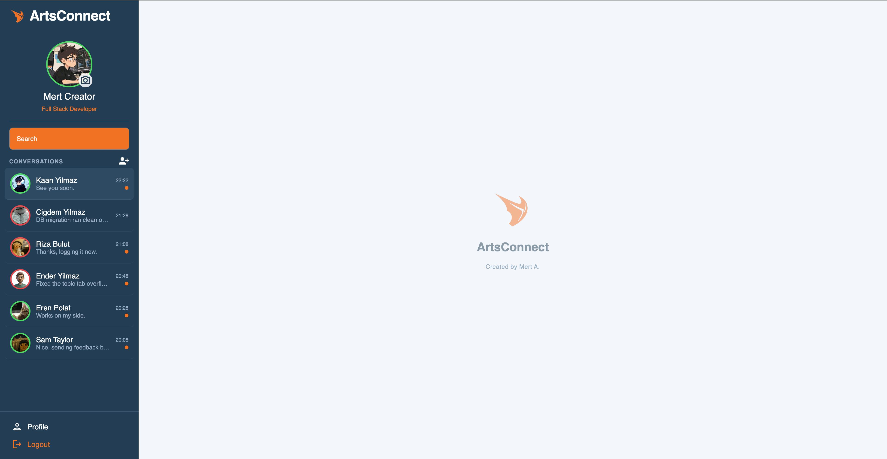
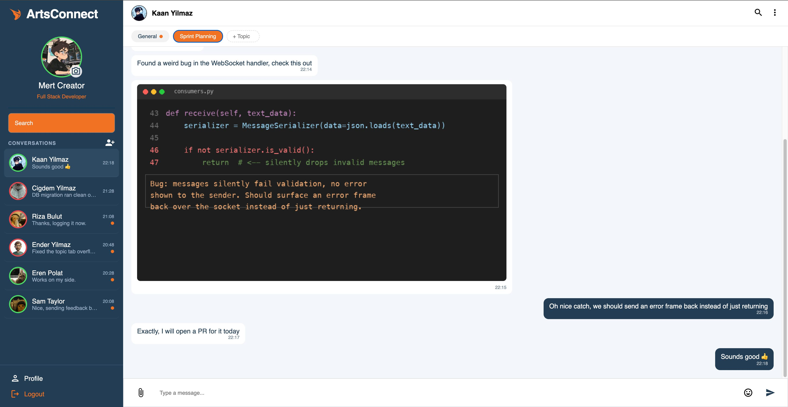
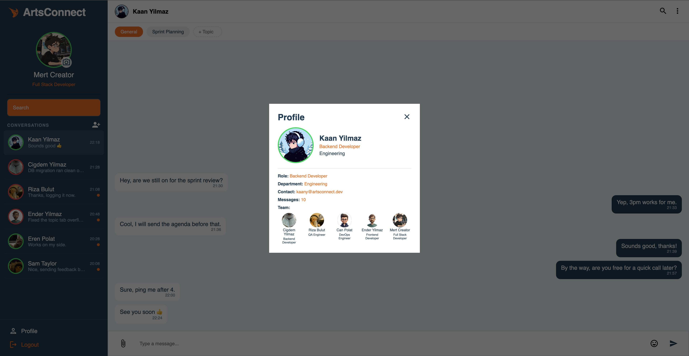
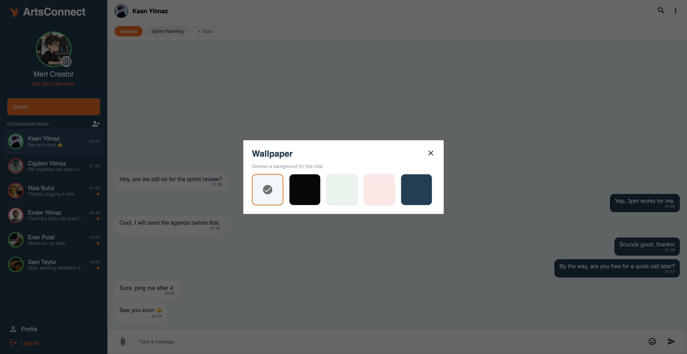

# ArtsConnect

Company-internal chat application built with Django REST Framework and React. Built as part of a one-month internship, focused on understanding the fundamentals rather than shipping a polished product — class-based views, DRF serializers, real-time messaging with Django Channels, and a React frontend without extra libraries beyond what was needed.

*(Demo data below — fictional users, no real company or personal information.)*



## What it does

- Register / login with token authentication
- One-on-one chats, with support for splitting a chat into topics
- Real-time messaging over WebSocket (Django Channels)
- Presence (online/offline) shown live via the same WebSocket connection
- Unread-per-topic indicators, last-message preview and activity-based ordering in the sidebar
- Profile pages with team info and per-user message counts (`annotate`/`aggregate`)
- Chat wallpaper, in-chat search, one-sided chat delete



Topics let a single conversation split into separate threads, each with its own unread indicator:



Profile view with department, role, team, and total message count:



Per-chat wallpaper picker:



## Stack

**Backend:** Django, Django REST Framework, Django Channels (WebSocket), PostgreSQL, Token authentication
**Frontend:** React (Vite), plain `fetch`, no state management library

## Why these choices

- **Class-based views** (`APIView`), no generic views (`ModelViewSet`, `CreateView`) — deliberately kept explicit so every line is easy to explain.
- **WebSocket for messaging**, HTTP for everything else — a chat needs a live push channel; the rest of the app (auth, profile, search) doesn't.
- **No Context API** — state is lifted only as far as it's actually shared (usually one level), so prop drilling stays shallow and Context wasn't needed.
- **No pagination yet** — messages are fetched in full per chat; acceptable at this scale, called out as a known limitation rather than hidden.

## Running it locally

```bash
# backend
cd backend
python -m venv venv && source venv/bin/activate
pip install -r requirements.txt
cp .env.example .env   # fill in your own SECRET_KEY and DB credentials
python manage.py migrate
python manage.py runserver

# frontend
cd frontend
npm install
npm run dev
```

Requires a running PostgreSQL instance matching the credentials in `.env`.

## Notes

This was built to learn, not to be production-ready — known gaps (no message pagination, no group chat UI yet, N+1 query in the chat list serializer) are intentional trade-offs made under a deadline, not oversights.
